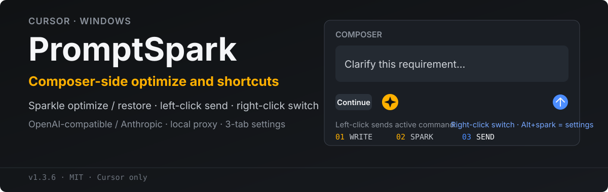

<p align="center">
  
</p>

<p align="center">
  <a href="https://github.com/xiaoyangtx996/PromptSpark/stargazers"></a>
  <a href="https://github.com/xiaoyangtx996/PromptSpark/issues"></a>
  <a href="./LICENSE"></a>
</p>

PromptSpark 在 Cursor 的 Composer 输入框旁增加一个优化按钮。写好草稿后点击一次，由你配置的 LLM 改写；再次点击即可恢复原文。右键或 `Alt + 点击` 打开设置。

> 当前安装入口仅开放已验证的 **Cursor for Windows**。Codex、Devin / Windsurf 与 Antigravity 仍在适配验证中。

## 界面预览

<p align="center">
  
</p>

<p align="center"><sub>设置 OpenAI 兼容或 Anthropic 接口，选择内置风格，或维护自己的 system prompt。</sub></p>

## 能做什么

- **优化与还原**：点击优化当前提示词，再次点击恢复原文。
- **随时取消**：请求进行中再次点击即可停止。
- **多种风格**：内置简洁、结构化、编程三种风格，支持自定义增删。
- **接口自选**：兼容 OpenAI 风格接口和 Anthropic API。
- **本地代理**：自动使用 `127.0.0.1:37841`，处理 Cursor / Electron 的 CORS 限制。
- **就地配置**：右键或 `Alt + 点击` 优化按钮，直接设置协议、Base URL、API Key、模型和风格。

## 快速开始

### 前置要求

- Windows
- [Node.js LTS](https://nodejs.org/)
- Cursor
- OpenAI 兼容或 Anthropic API

### 一键安装

在系统 PowerShell 中运行：

```powershell
irm https://raw.githubusercontent.com/xiaoyangtx996/PromptSpark/main/scripts/install.ps1 | iex
```

国内网络可使用镜像：

```powershell
irm https://wget.la/https://raw.githubusercontent.com/xiaoyangtx996/PromptSpark/main/scripts/install.ps1 | iex
```

安装器会请求 UAC 管理员权限，关闭 Cursor，写入外部脚本并更新 checksum，随后重新启动 Cursor。写入遇到占用时最多重试 3 次。

安装后：

1. 在 Cursor Composer 中输入提示词。
2. 点击输入框右侧的闪光按钮开始优化。
3. 再次点击恢复原文；优化过程中点击则取消请求。
4. 右键或 `Alt + 点击` 按钮，完成首次配置。

## 首次配置

| 字段 | 填写内容 |
|:---|:---|
| 协议 | `OpenAI 兼容` 或 `Anthropic` |
| Base URL | 例如 `https://api.example.com/v1` |
| API Key | 对应服务商的 API 密钥 |
| Model | 例如 `gpt-4o-mini` 或 `claude-...` |
| 风格 | 内置风格，或自定义名称和 system prompt |

点击 **存储** 后生效。配置保存在 Cursor 的本地存储中；API 请求通过本机代理转发。

## 安装与卸载

指定 Cursor 或跳过自动重启：

```powershell
# 安装到 Cursor
iex "& { $(irm https://raw.githubusercontent.com/xiaoyangtx996/PromptSpark/main/scripts/install.ps1) } -Hosts cursor"

# 安装后不自动重启 Cursor
iex "& { $(irm https://raw.githubusercontent.com/xiaoyangtx996/PromptSpark/main/scripts/install.ps1) } -Hosts cursor -NoRestart"

# 卸载
iex "& { $(irm https://raw.githubusercontent.com/xiaoyangtx996/PromptSpark/main/scripts/install.ps1) } -Uninstall"
```

若镜像缓存了旧脚本，可附加时间戳：

```powershell
irm "https://wget.la/https://raw.githubusercontent.com/xiaoyangtx996/PromptSpark/main/scripts/install.ps1?$(Get-Date -Format yyyyMMddHHmmss)" | iex
```

## 工作方式

```text
Composer 草稿
      │
      ▼
PromptSpark 按钮 ──► 本地代理 127.0.0.1:37841 ──► 你的 LLM API
      ▲                                                   │
      └──────────── 优化结果写回 / 一键恢复原文 ◄─────────┘
```

Cursor 的 CSP 不允许内联脚本，因此安装器会：

1. 将构建产物写为 Workbench 同目录下的 `promptspark.js`。
2. 在 `workbench.html` 中加入同源外部脚本引用。
3. 更新 `product.json` 中对应的 Workbench checksum。
4. 卸载时移除引用和外部脚本。

## 支持状态

| 应用 | 状态 | 说明 |
|:---|:---:|:---|
| Cursor | 已开放 | Windows 安装链路已验证 |
| Codex | 待验证 | 安装入口尚未开放 |
| Devin / Windsurf | 待验证 | 安装入口尚未开放 |
| Antigravity | 待验证 | 安装入口尚未开放 |

## 本地开发

不要在 Cursor 内置终端中执行安装，因为安装器需要关闭 Cursor。请使用系统 CMD 或 PowerShell：

```powershell
git clone https://github.com/xiaoyangtx996/PromptSpark.git
cd PromptSpark
npm install
npm run build
node install.mjs --hosts=cursor
```

常用命令：

```powershell
npm run build
node install.mjs --hosts=cursor --no-restart
node install.mjs --uninstall
node scripts/rebuild-cursor.mjs
```

<details>
<summary><strong>项目结构</strong></summary>

```text
PromptSpark/
├── assets/readme/           # README 视觉资源
├── image/                   # 产品截图
├── scripts/
│   ├── install.ps1          # 远程一键安装入口
│   ├── install-cursor.cmd   # 本地 Cursor 安装入口
│   └── rebuild-cursor.mjs   # 构建并重装
├── src/
│   ├── prompt-optimize.codex-source.js
│   ├── host-adapters.js     # 宿主检测与按钮挂载
│   ├── settings-dom.js      # 设置面板
│   └── theme-css.css
├── dist/prompt-optimize.js  # 构建产物
├── install.mjs              # 安装、提权与 checksum 更新
├── proxy.mjs                # 本地 LLM 代理
└── build.mjs
```
</details>

## 常见问题

<details>
<summary><strong>找不到 Node.js</strong></summary>

安装 [Node.js LTS](https://nodejs.org/)，关闭并重新打开 PowerShell，然后重新执行安装命令。
</details>

<details>
<summary><strong>没有出现 UAC 或安装提示权限不足</strong></summary>

请从系统 CMD / PowerShell 运行安装器，不要使用 Cursor 内置终端。安装器会自动请求管理员权限。
</details>

<details>
<summary><strong>安装成功但看不到优化按钮</strong></summary>

确认输出包含 `Cursor: installed`，然后完全退出并重新打开 Cursor。按钮位于 Composer 右下角的图片和麦克风等工具附近。
</details>

<details>
<summary><strong>提示 Failed to fetch 或 CORS</strong></summary>

检查 `http://127.0.0.1:37841/health`。本地安装可在仓库目录执行 `node proxy.mjs`；远程安装可在 `%LOCALAPPDATA%\PromptSpark` 中执行相同命令。
</details>

<details>
<summary><strong>自定义风格保存后消失</strong></summary>

新增风格后仍需点击设置面板底部的 **存储**，才会写入本地存储。
</details>

## 安全说明

- 安装器会修改 Cursor 的 `workbench.html`，写入 `promptspark.js`，并更新 `product.json` checksum。
- API Key 仅保存在本机 Cursor 设置存储中，不会提交到本仓库。
- 本地代理只监听 `127.0.0.1:37841`。
- 请仅从本仓库官方地址获取安装脚本，并遵守所用 API 服务商条款。

## 反馈与贡献

- Bug 或需求请提交 [Issue](https://github.com/xiaoyangtx996/PromptSpark/issues)。
- 欢迎通过 Pull Request 改进宿主适配、安装体验和文档。

## License

PromptSpark 使用 [MIT License](./LICENSE)。

友链：[LINUX DO 社区](https://linux.do)。

© PromptSpark contributors
